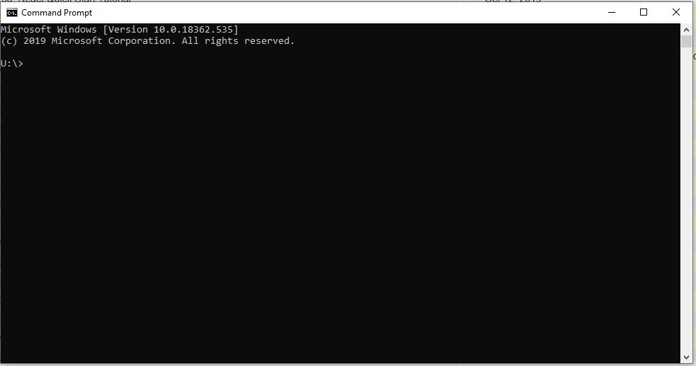

<div class="ui small rounded images">
  
   
</div>

An example of a good question I found on stack overflow is “How do I declare and initialize an array in Java?” This is a good question because it is concise. It specifies which language he is trying to work in and also states the goal clearly. Thus the answer to the question is straightforward. Here a part of the answer. 


For primitive types:

```
int[] myIntArray = new int[3]; int[] myIntArray = {1, 2, 3}; int[] myIntArray = new int[]{1, 2, 3};
```
From this the user can try out the code on their device and people with the same question can do the same. This question in theory should not be asked again. 


Next, we will go over a question could be asked in a smarter way. 


Help me to Get this code work 

What is wrong with this code? i can get correct value? DrvUsg always getting zero. please help me to get work this code.
```

   	 Computer cmp = new Computer();

   	 string SysDrv = System.Environment.SystemDirectory.Substring(0, 2);

    	UInt64 TotalDrv = Convert.ToUInt64(cmp.FileSystem.GetDriveInfo(SysDrv).TotalSize / 1024 / 1024);

   	 UInt64 FreeDrv = Convert.ToUInt64(cmp.FileSystem.GetDriveInfo(SysDrv).AvailableFreeSpace / 1024 / 1024);

  	  UInt64 UsedDrv = (TotalDrv - FreeDrv);

   	 UInt64 DrvUsg = Convert.ToUInt64((UsedDrv / TotalDrv) * 100);

   	 TrkDrvUsg.Value = (int)DrvUsg;

   	 LblDrvUsg.Text = (String.Format("System drive usage: {0}%", DrvUsg));

```
First of all, their grammar is wrong. It may have been that English was their second language, but they did not explicitly say that in the post. The post title is not even in a question format. It is unlikely that a hacker will help when they read “Help me to Get this code work” because the request is too general. A better way to ask this was to specify which language he was working in and to give what the expected value was. The person that answered this would have had to go through his code, understand it, and figure out what the correct value was. It was nice that this person was nice but from the article how to ask questions the smart way, the hacker would not have answered this post. 

### conclusion 

Being mindful of asking smarter questions is because it will help both parties, the asker and the helper. When the asker asks questions in a way that the helpers can easily understand, the helper does not need to gather more information from the asker and takes less time. The asker will get the solution to the problem faster without unnecessary hassle. As such, when asking smarter questions things move smoothly when compared to if the question was not asked in a smart way. 


Provided below are links used in this essay. 

[Link 1](https://stackoverflow.com/questions/5280658/help-me-to-get-this-code-work)


[Link 2](https://stackoverflow.com/questions/1200621/how-do-i-declare-and-initialize-an-array-in-java) 


