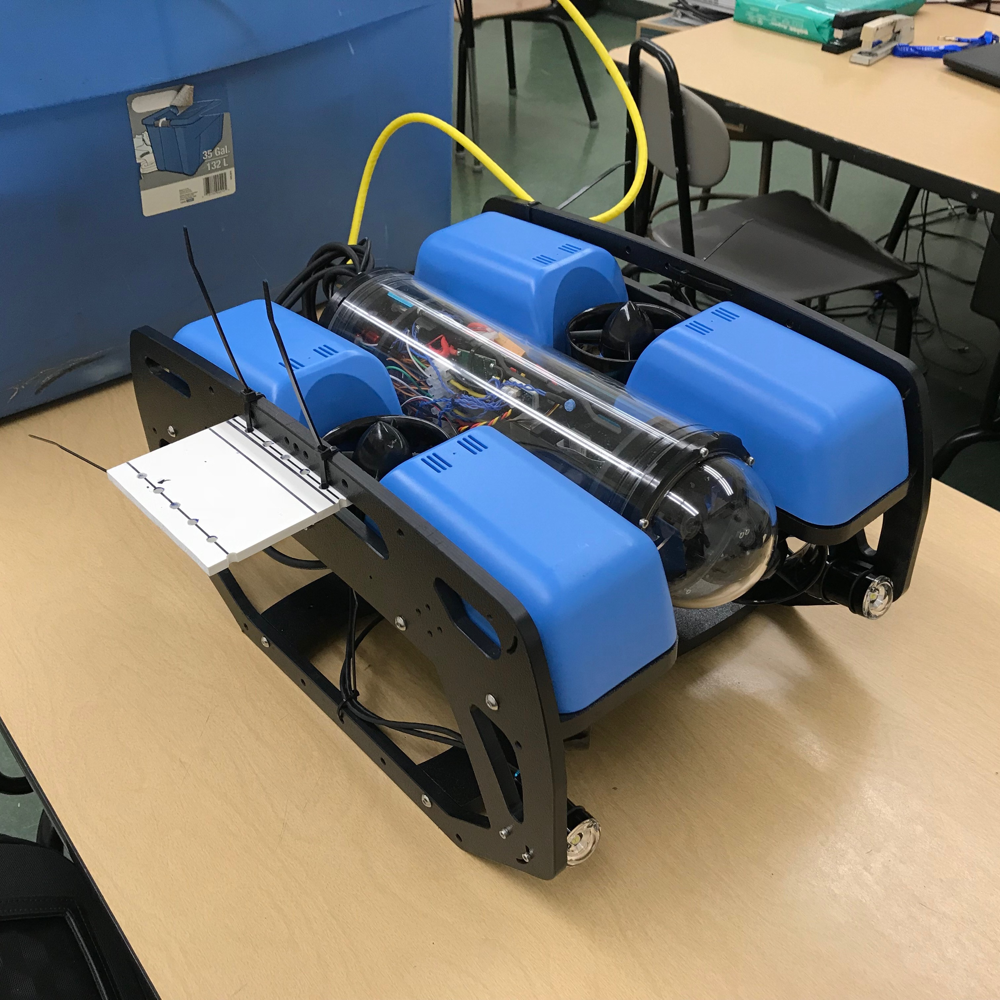
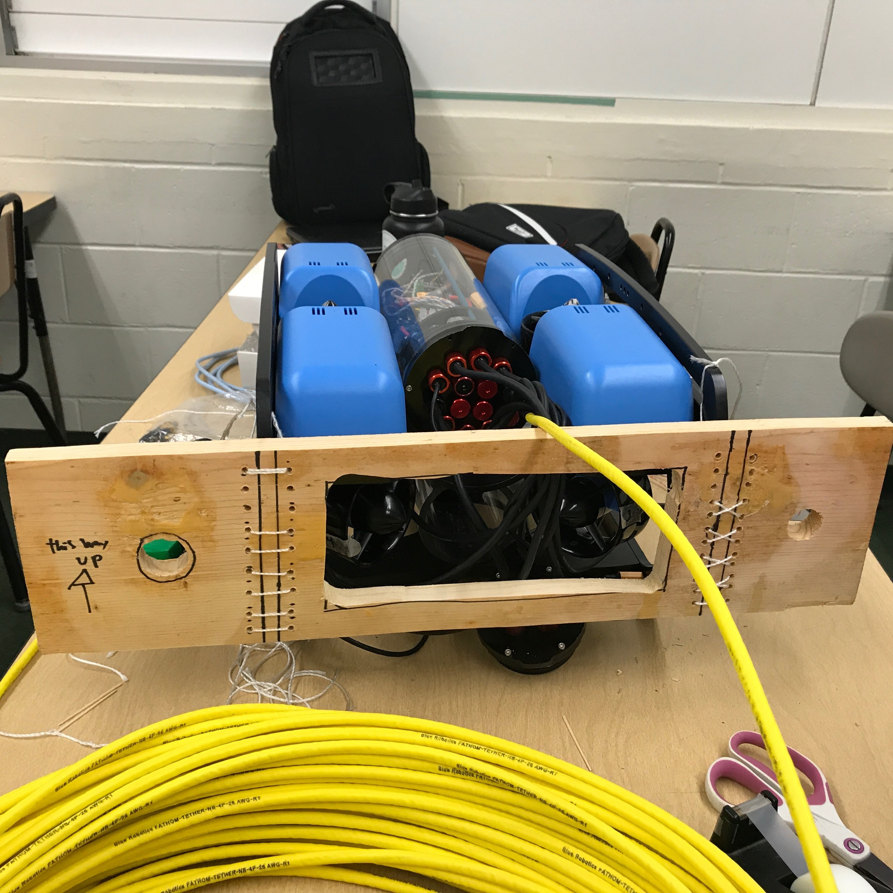

  
  

UROV is short for Underwater Remotely Operated Vehicle.  
In this project I learned how to use the 3D printer. I used a program called Fusion 360 to create a 3D rendering of what I wanted to print. Then I converted the file into a printable file and sent the data to the 3D printer. I printed clamps for my rover. those clamps were held together by zip ties.   

We used some wood work as well. In this project I learned how to use the jacksaw. With the tool, I cut out some simple shapes to attach to the rover. I measured, marked and cut the wood. We also used the drill to open holes in the wood. Most of our attachments were secured with zip ties because zip ties were cheap and also easily removeable. 

You can learn more at the [UROV Website](http://www2.hawaii.edu/~hanaia/UROV.html).

