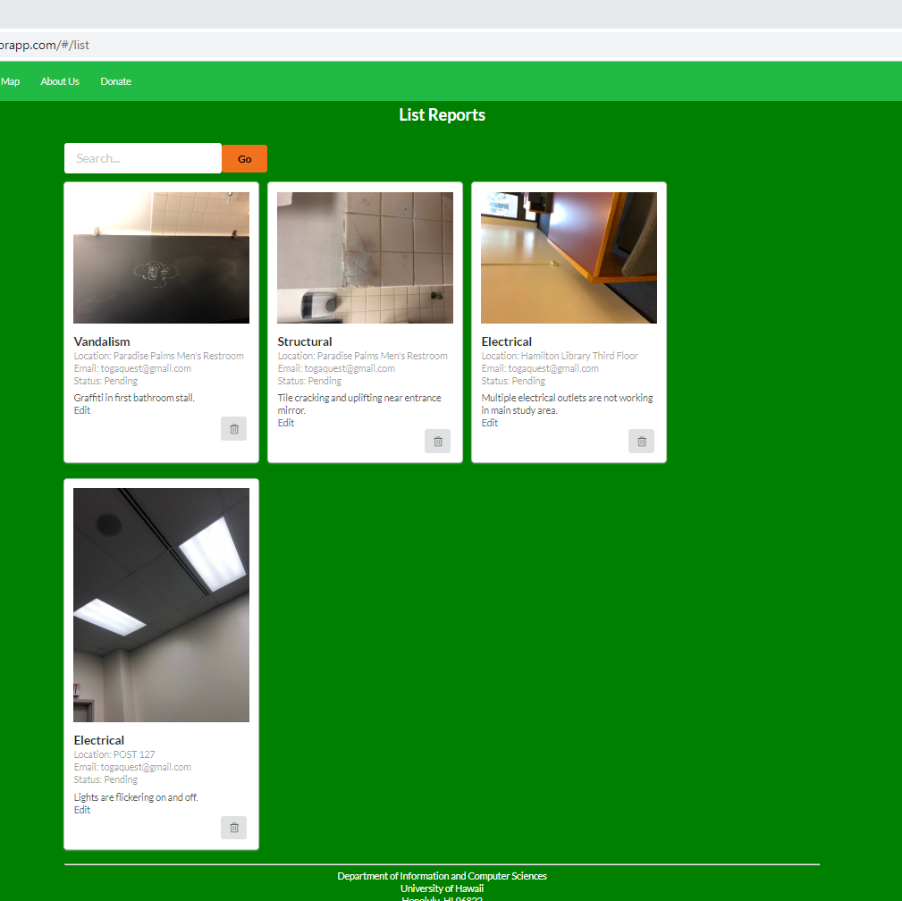
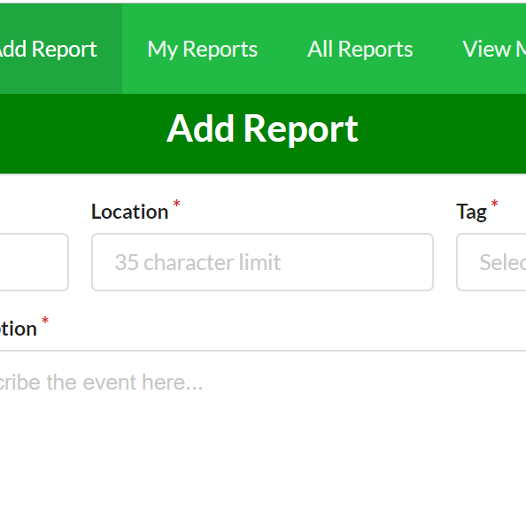

  
  

The University of Hawaii at Manoa faces many issues throughout its campus. The staff works hard to maintain a clean and safe environment for the students. However the eyes of the staff cannot see everything, so they may miss some issues. This is where this app comes in so that students can upload their issues when they see them. With this, the university can get more informed reports in a timely manner. 

We were a team of 3 that coded the app. I was in charge of the front end of the website. The page I worked on the most is the about page. I wrote most of the contents of the page and the video on there. Our team was good at splitting the task. Each of us did what we were supposed to do and development was a smooth process. The hardest task I worked on during this project was the search function to look up a report from all the reports.  

Working on this project, I learned what backend vs front end was. I used HTML a lot during this project. Many of the things I did were simple tasks, but I think that my tasks were important for the success of the project. One important thing I learned is how websites work and the color scheme used in web sites. If you used similar colors for your website, words may not be readable as compared if you used contrasting colors. In that way, I felt that web design was similar to a painting in that you need to think carefully about your colors. Another thing I learned during this project was that the contents of the website and its function is separate. Before diving in  the project and working, I thought that the buttons and inputs for a website had built-in functionality because they seemed very integrated and inseparable elements. However they were different things. Overall the project was a fanstastic learning experience.  

You can learn more at the [manoa-fixed Website](https://github.com/manoa-fixed).

