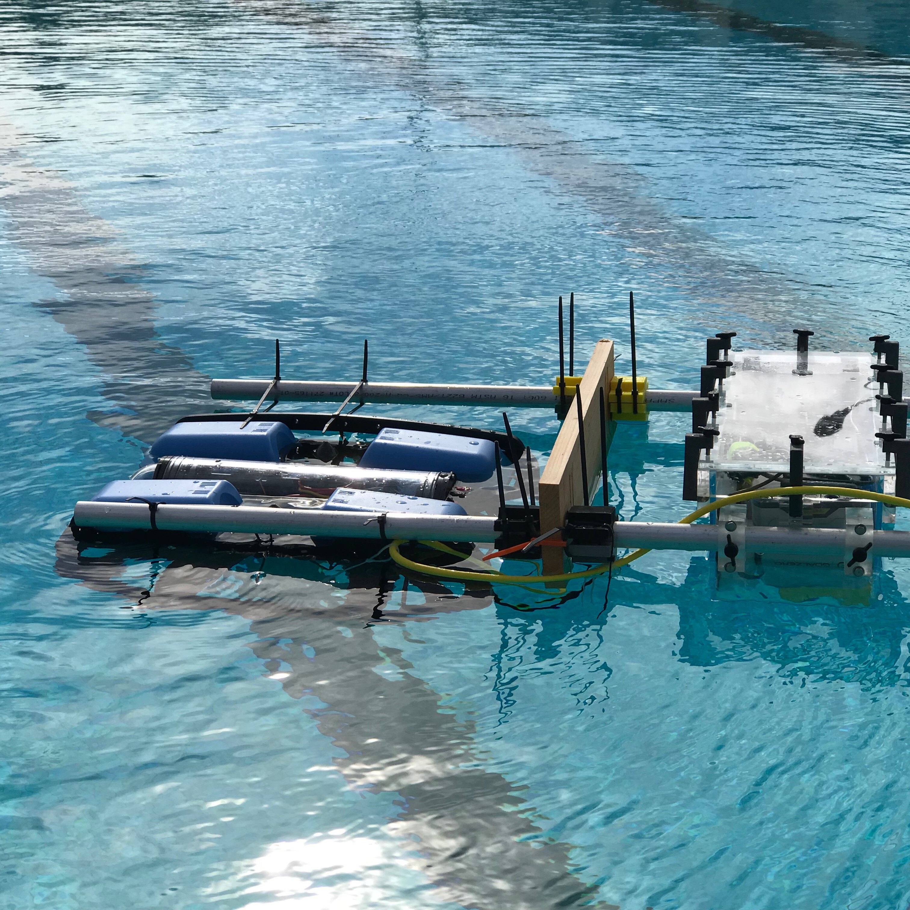

The dragon slayer is an rpg where you have 5 days to train before you fight with the dragon. You are given 4 choices each day. Your choices will change the character's abilities and stats. After the 5 days you fight with the dragon. 
 
Source: <a href="https://github.com/theVacay/vacay"><i class="large github icon"></i>theVacay/vacay</a>
