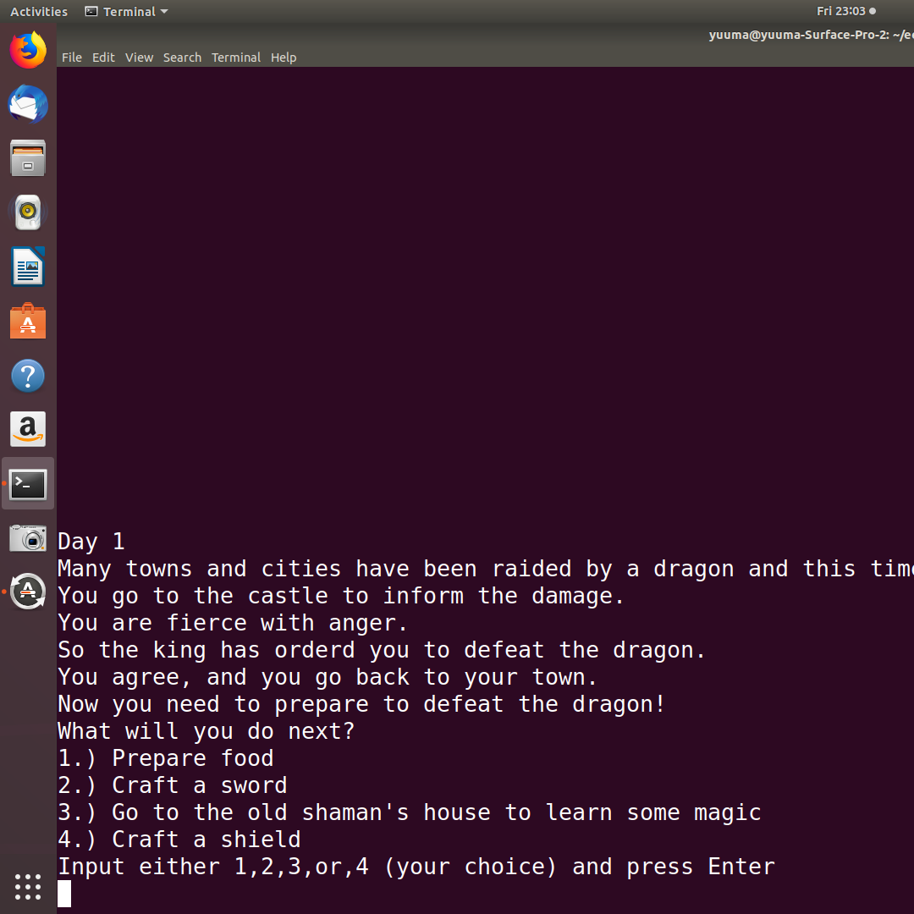
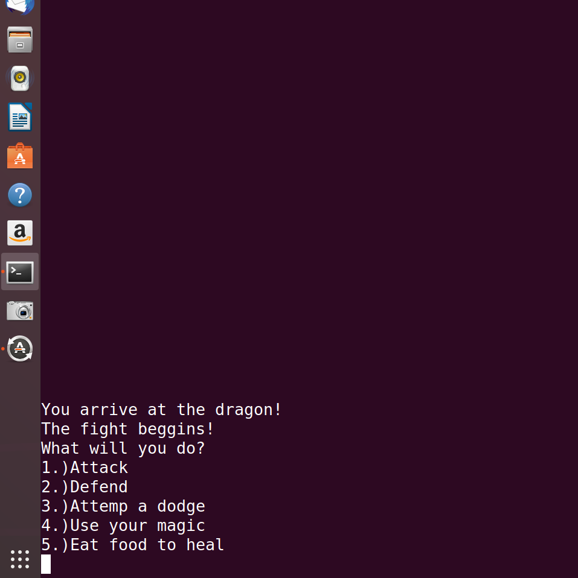
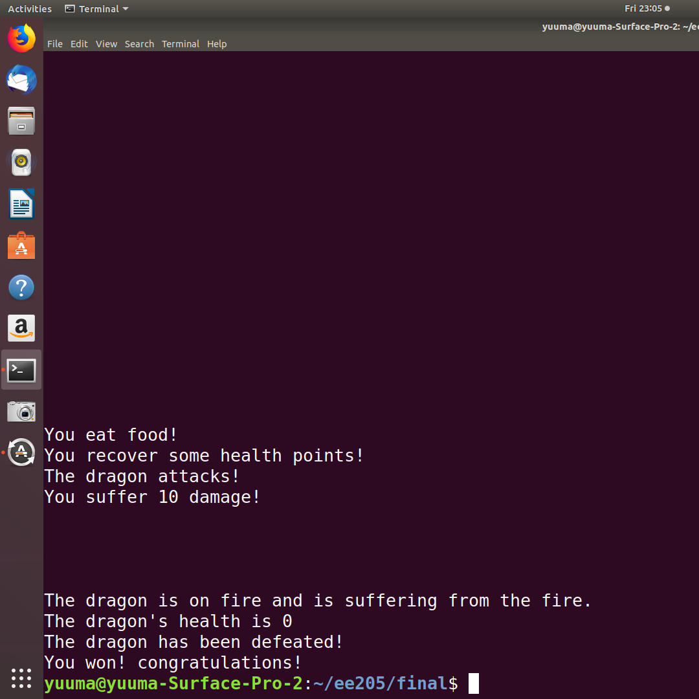

The dragon slayer is an RPG where you have 5 days to train before you fight with the dragon. You are given 4 choices each day. Your choices will change the character's abilities and stats. After the 5 days, you fight with the dragon. The player gets a couple of choices during the battle with the dragon. 

This was coded in about a week. For that week it was almost straight coding. The hardest part of the game was all of the if and else statements I needed to put in. Considering all cases took a long time as well. The player will go through one path of all the paths that exist. there are more than 256 different paths in the game. Trying to come up with stories for each of the path was very challenging.  

This game was one of the games put into the whole library of games. Our team decided that we wanted to make a console that ran several games. So our team each made a game and put them together at the end. Other members tried to make graphical games but I decided to make a text-based game because I like the look of text-based games. In the future, I may create games that have graphics or still continue to explore the possibilities of text-based games. 
 

