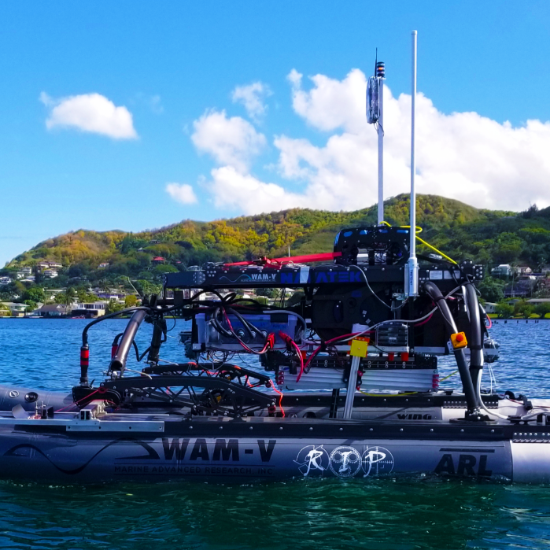

  
  

Team Kanaloa is a robotics team at UH. The goal of the team is to build an autonomous vehicle to win in a competition. 

In the team, I was in the coding team. I learned a little about Robot OS in the team. We used python to code out the robot. At that time, I did not know python well, so it was really hard for me to contribute to the team. I really liked coding so I stayed on the team as long as I possibly could. We mostly worked in ubuntu throughout the semester. 

Then I changed teams to the hardware team. There I learned how to make Ethernet cables. Before this class, I did not know how to make any cables. At first, cable making was a very hard task. However, as I worked the process gradually got easier. Making mounts to the big boat was my main task.  

I enjoyed the demo experience during this project. We had many unmanned vehicles from drones to boats to submarines. It was exciting to see all of the technology being developed at UH. I plan to join the same or similar project during my senior year. I hope to learn and apply what I learned during my college years for that project. 

You can learn more at the [RIP Website](http://rip.eng.hawaii.edu/projects/team-kanaloa-ordnance-reef/).

